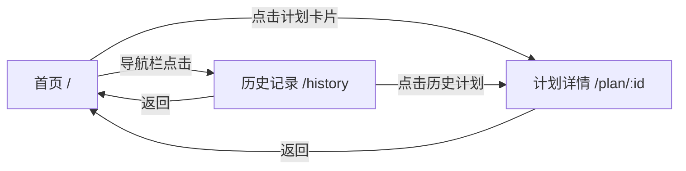

# 个人计划规划网页应用 - 技术开发需求文档

## 1. 项目概述

### 1.1 一句话定位
一个轻量级、纯前端的个人计划管理工具，帮助用户记录、追踪和回顾日常任务与计划。

### 1.2 目标用户
- 需要简单计划管理工具的个人用户
- 注重隐私、偏好本地存储的用户
- 希望快速上手、无需学习复杂系统的用户

---

## 2. 核心功能模块

### 2.1 计划管理模块
**功能描述：** 用户可以创建、编辑、删除、查看计划任务。

**交互逻辑：**
- 点击"新建计划"按钮打开表单模态框
- 输入任务标题（必填）、内容描述（选填）、截止时间（选填）
- 提交后在计划列表中新增任务卡片
- 点击任务卡片进入详情页或直接在列表中操作
- 支持标记任务为"进行中"或"已完成"
- 支持编辑和删除已有任务

### 2.2 历史记录模块
**功能描述：** 展示已完成的任务，按时间维度组织，方便用户回顾。

**交互逻辑：**
- 自动收录标记为"已完成"的任务
- 按年/月/日分组展示
- 支持按时间范围筛选
- 点击历史任务查看详情
- 支持永久删除历史记录

### 2.3 状态管理模块
**功能描述：** 管理任务的状态流转（进行中 ↔ 已完成）。

**交互逻辑：**
- 新建任务默认状态为"进行中"
- 在任务卡片上提供状态切换按钮
- 状态变更实时更新界面
- 完成任务自动移入历史记录

---

## 3. 数据模型设计

### 3.1 计划任务（Plan）数据模型

| 字段名 | 数据类型 | 必填 | 默认值 | 说明 |
|--------|----------|------|--------|------|
| id | string | 是 | 自动生成 | 唯一标识符（UUID） |
| title | string | 是 | - | 计划标题 |
| content | string | 否 | '' | 计划详细描述 |
| createdAt | Date | 是 | 当前时间 | 创建时间 |
| dueDate | Date | 否 | null | 截止时间 |
| completedAt | Date | 否 | null | 完成时间 |
| status | string | 是 | 'in_progress' | 状态：'in_progress'（进行中）/ 'completed'（已完成） |

### 3.2 TypeScript 类型定义

```typescript
type PlanStatus = 'in_progress' | 'completed';

interface Plan {
  id: string;
  title: string;
  content: string;
  createdAt: Date;
  dueDate: Date | null;
  completedAt: Date | null;
  status: PlanStatus;
}
```

---

## 4. 页面结构与路由

### 4.1 页面列表

| 路由路径 | 页面名称 | 说明 |
|----------|----------|------|
| / | 首页（计划列表） | 展示进行中的计划 |
| /plan/:id | 计划详情页 | 查看单个计划的详细信息 |
| /history | 历史记录页 | 展示已完成的计划 |

### 4.2 页面跳转关系



---

## 5. 非功能性需求

### 5.1 性能需求
- 页面加载时间 < 2秒
- 计划列表支持至少 1000 条记录流畅展示
- 本地存储数据压缩率 > 30%（使用 JSON 压缩算法）

### 5.2 存储方案
- 使用浏览器 localStorage 存储所有数据
- 数据结构使用 JSON 格式序列化
- 定期自动备份机制（可选导出功能）
- 最大存储容量限制提醒（localStorage 通常 5-10MB）

### 5.3 兼容性需求
- 支持现代浏览器：Chrome 90+, Firefox 88+, Safari 14+, Edge 90+
- 响应式设计，支持桌面端和移动端
- 无网络环境下完全可用

### 5.4 安全性
- 所有数据存储在本地，不上传服务器
- 不收集用户隐私信息
- 提供数据导出/导入功能，防止数据丢失

---

## 6. 技术选型建议

### 6.1 技术栈对比

| 方案 | 前端框架 | 存储方案 | 部署方式 | 成本 | 复杂度 |
|------|----------|----------|----------|------|--------|
| 方案一（推荐） | React + Vite | localStorage | GitHub Pages | 零 | 低 |
| 方案二 | Vue 3 + Vite | localStorage | GitHub Pages | 零 | 低 |
| 方案三 | 原生 HTML/JS | localStorage | GitHub Pages | 零 | 极低 |
| 方案四 | Next.js | IndexedDB | Vercel | 零 | 中 |

### 6.2 推荐方案（方案一）

**技术栈：**
- **前端框架**：React 18 + TypeScript
- **构建工具**：Vite
- **样式方案**：Tailwind CSS
- **状态管理**：React Context API / useReducer
- **存储**：localStorage
- **部署**：GitHub Pages

**推荐理由：**
1. **低成本**：所有技术都是开源免费，部署在 GitHub Pages 零费用
2. **易部署**：GitHub Pages 一键部署，支持自动构建
3. **可开源**：React 生态完善，代码易于维护和开源
4. **开发效率**：Vite 热更新快，开发体验好
5. **扩展性**：未来需要添加更多功能时，React 生态支持良好

---

## 7. 后续开发步骤建议

### 7.1 优先级划分

#### 第一阶段（MVP - 最小可行产品）
- [ ] 项目初始化（React + Vite + Tailwind CSS）
- [ ] 基础页面布局和路由配置
- [ ] 计划数据模型和 localStorage 存储逻辑
- [ ] 首页：计划列表展示
- [ ] 新建/编辑计划功能
- [ ] 任务状态切换（进行中 ↔ 已完成）

#### 第二阶段（核心功能完善）
- [ ] 计划详情页
- [ ] 历史记录页（按时间分组）
- [ ] 删除计划功能
- [ ] 响应式设计适配

#### 第三阶段（增强功能）
- [ ] 数据导出/导入功能
- [ ] 截止时间提醒（浏览器通知）
- [ ] 任务搜索和筛选
- [ ] 深色模式支持

#### 第四阶段（优化和开源）
- [ ] 性能优化
- [ ] 代码完善和文档编写
- [ ] 开源准备（LICENSE、README）
- [ ] GitHub Pages 部署

---

## 8. 开源与维护建议

### 8.1 开源策略
- 使用 MIT 许可证（最宽松的开源协议）
- 建立清晰的贡献指南
- 使用 GitHub Issues 管理需求和 Bug

### 8.2 资源消耗
- **开发资源**：业余时间即可完成 MVP
- **维护资源**：每月几小时处理 Issues 和更新依赖
- **服务器资源**：零（纯前端 + GitHub Pages）

---

*文档版本：v1.0*  
*创建日期：2026-04-13*
